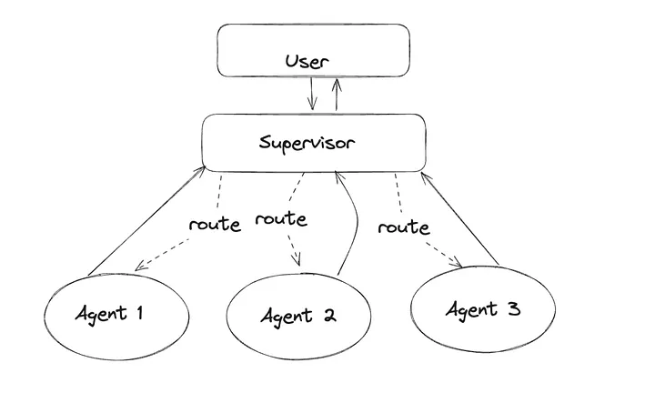
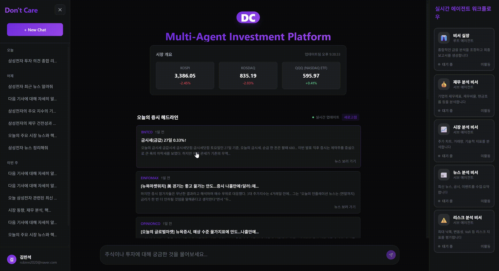

  
  <h2> Don’t Care (돈케어) : 투자 결정을 돕는 AI 에이전트 기반 대화형 서비스 </h2>
  
 복잡한 투자 정보 분석을 한 서비스 내에서 해결한다 

## 🚀 프로젝트 소개 
**"투자 결정을 돕는 AI 에이전트 기반 대화형 서비스"**

> ## Don’t Care(돈케어)는
> 복잡하고 번거로운 투자 정보 분석 과정을 하나의 플랫폼에서 해결합니다.  
실시간 금융 데이터와 기업 공시 정보, 뉴스 분석, 기술적 지표, 백테스트 결과를 종합해 **신뢰성 있는 투자 인사이트**를 제공합니다.

- 개발 기간 : 2025.08.25 ~ 2025.09.29 (5주)
- 플랫폼 : Web
- 개발 인원 : 6명

## 프로젝트 특징

### 🖥️멀티 에이전트 시스템(MAS)

**SuperVisor**패턴의 멀티 에이전트 아키텍처를 챗봇으로 구현하여 각 분야의 **전문 Agent**를 구성하였습니다.

 
(출처 : LangChain)

### ADK와 SuperVisor Agent 패턴
**Google ADK(Agent Development Kit)** 를 활용하여 Agent구현
1. **Sub Agent 병렬 처리**로 인한 응답속도 개선
2. 전문 Agent가 **MCP tool**을 통해 조사를 진행하고 결과를 생성하여 **효율적인 Context관리**
3. **수평적 Sub Agent 배치**와 **A2A**를 통해 쉽게 확장 가능
4. 전문 **MCP tool**을 통해 **실시간 데이터** 응답 생성
5. **Google Cloud Memory Bank**를 활용하여 **장기기억 & 세션** 관리

---

## 🛠️ 기술 스택 

### Frontend

### Backend

### AI / Agents

### Infra & DevOps

### Database

### Tools

---

## 💡 주요 기능 

| 기능 | 설명 |
|------|------|
| **뉴스 에이전트** | Gemini + 검색 API를 활용, 출처 포함 뉴스 요약 제공 |
| **재무 분석 에이전트** | DART API 기반 기업 재무제표 분석 → 수익성/안정성/성장성 지표 도출 |
| **기술적 분석 에이전트** | yfinance 기반 RSI, MACD, 이동평균선, 볼린저밴드 계산 → 전략 제안 |
| **리스크 분석 에이전트** | 과거 주가 데이터 기반 백테스트 → 전략 리스크 및 수익성 평가(이동 평균선 & MACD 전략) |
| **멀티 에이전트 라우팅** | Root Agent가 질문 의도 분석 후 적절한 전문 에이전트로 라우팅 |
| **투자 리포트 제공** | 종합 뉴스 + 재무 + 기술 + 백테스트 결과를 리포트 형태로 제공 |

---

## 📂 시스템 아키텍처 

<!--  -->

- **사용자** → Nginx(443) → Backend(Django) / AI(FastAPI)  
- **Backend** → PostgreSQL, Redis  
- **AI 서버** → ADK 기반 멀티에이전트 → Google Cloud Memory Bank
- **외부 API** → 한국투자증권 API, DART API, Naver 뉴스 API, yfinance  
- **CI/CD** → GitLab → Jenkins → Docker → EC2 배포  

---

### 서비스 화면 
- 랜딩 페이지: 서비스 소개 및 투자 보조 기능 안내

- 에이전트 시연: 뉴스/재무/기술/리스크 분석 대화 흐름

- 투자 리포트 결과 화면: 데이터·지표 시각화, 출처 포함

---

## 👨‍👩‍👧‍👦 개발 팀 소개 
| 이름  | 역할           |
| --- | ------------ |
| 김민석 | `FE` `Leader`         |
| 김민수  | `Infra`         |
| 노혜성 | `FE`         |
| 박진호 | `AI`         |
| 조민규 | `BE`         |
| 임연지 | `AI`        |

## 🗓️ 개발 일정 

- **1주차 (2025.08.25 ~ 2025.08.31)**: 프로젝트 기획  
- **2주차 (2025.09.01 ~ 2025.09.07)**: 설계 및 구체화  
- **3주차 (2025.09.08 ~ 2025.09.14)**: 프론트/백엔드 기본 구현  
- **4주차 (2025.09.15 ~ 2025.09.21)**: AI/에이전트 연동, 데이터 수집  
- **5주차 (2025.09.22 ~ 2025.09.28)**: 통합 테스트 및 배포  
- **최종 발표 (2025.09.29)**: 최종 마무리 및 발표  

## 프로젝트 회고

### 역할 : Agent 설계 및 구현

프로젝트 진행 개인 회고

## Don’t Care(돈케어) 프로젝트 회고: 투자 결정 지원 AI 에이전트 구축 경험

### 🚀 **Summary: 프로젝트의 핵심 도전과 성취**

본 프로젝트는 제한된 시간과 리소스 속에서 **투자 결정을 돕는 신뢰성 있는 AI 서비스**를 구축하는 것을 목표로 했습니다. 이를 위해 **Google ADK 기반의 Supervisor 멀티 에이전트 시스템**을 도입하여 확장성과 응답 속도라는 두 마리 토끼를 잡았습니다. 특히, 짧은 개발 기간(5주)이라는 제약 속에서도 **Google Cloud Memory Bank**를 활용해 사용자 맞춤형 장기 기억 기능을 빠르게 프로토타입으로 구현한 점은 효율적인 기술적 의사결정이었습니다. 비록 Root Agent의 판단 로직에 대한 투명성 확보나 자체 장기 기억 시스템 구축과 같은 과제가 남았지만, 이는 향후 서비스 고도화에서 구현할 수 있다고 생각합니다.
***

### 1. 아키텍처 설계 회고: Supervisor 패턴의 선택과 한계

**Google ADK와 Supervisor 패턴의 시너지**
짧은 5주라는 개발 기간 동안 복잡한 금융 데이터를 다루는 챗봇을 완성하기 위해 **Google ADK(Agent Development Kit)** 를 선택한 것은 좋은 선택이었습니다. ADK는 빠른 프로토타이핑뿐만 아니라 테스트 환경까지 제공해주어 개발 속도를 비약적으로 높여주었습니다.
특히 **Supervisor 패턴**을 채택함으로써 얻은 이점은 명확했습니다.
*   **병렬 처리 & 속도 개선:** Root Agent(Supervisor)가 사용자의 의도를 파악하고 뉴스, 재무, 기술, 리스크 분석 등 전문 에이전트들에게 동시에 명령을 하달함으로써, 순차적 처리 방식보다 훨씬 빠른 응답 속도를 확보할 수 있었습니다.
*   **확장성:** 수평적 서브 에이전트 구조 덕분에 새로운 분석 도구나 기능을 가진 에이전트를 추가하는 것이 매우 용이했습니다. 이는 향후 추가적인 에이전트의 확장 가능성을 열어두었습니다.
*   **전문성 강화:** 각 서브 에이전트가 자신의 역할에 특화된 **MCP(Model Context Protocol) Tool**을 보유하게 함으로써, 환각 현상을 줄이고 데이터에 기반한 정확한 분석 결과를 생성할 수 있었습니다.

#### **아쉬움과 개선점: 블랙박스와 프롬프트 관리**
Root Agent가 어떤 기준으로 에이전트를 선택하고 라우팅하는지 내부 로직이 불투명한 **'블랙박스'** 문제는 디버깅과 최적화를 어렵게 했습니다. 또한, Root Agent가 똑똑하게 행동하게 만들기 위해 수많은 System Prompt를 주입하다 보니, 프롬프트가 비대해지고 관리가 복잡해지는 부작용을 겪었습니다. 향후에는 **LangGraph**와 같이 제어 흐름을 더 명시적으로 관리할 수 있는 프레임워크를 검토하거나, 라우팅 로직을 별도의 경량화된 모델로 분리하는 방안을 고려해볼 필요가 있습니다.

***

### 2. 메모리 시스템 회고: 현실적인 타협과 미래의 과제

**빠른 구현을 위한 전략적 선택: Google Cloud Memory Bank**
초기 목표는 MongoDB를 활용해 사용자 대화 세션과 메타데이터를 직접 관리하는 장기 기억 시스템을 구축하는 것이었습니다. 하지만 5주라는 시간은 이를 완벽하게 구현하고 테스트하기에 턱없이 부족했습니다.
이에 대한 대안으로 **Google Cloud Memory Bank**를 도입한 것은 프로젝트의 완성도를 높이는 데 결정적인 역할을 했습니다.
*   **즉각적인 도입:** 복잡한 DB 스키마 설계나 인덱싱 고민 없이, API 연동만으로 사용자별 세션 관리와 장기 기억 기능을 구현할 수 있었습니다.
*   **사용자 경험 향상:** 이전 대화 맥락을 기억하고 사용자의 투자 성향을 반영한 답변을 제공함으로써, 단순한 1회성 문답을 넘어선 '대화형 서비스'의 경험을 제공할 수 있었습니다.

#### **남겨진 과제: 비용과 커스터마이징**
Memory Bank는 훌륭한 도구였지만, 지속적인 비용 발생과 커스터마이징의 한계라는 단점도 명확했습니다. 프로토타입 단계에서는 효율적이었지만, 정식 서비스로 발전시키기 위해서는 결국 **자체 장기기억 서비스**를 구축하는 것이 필수적입니다. 이를 통해 비용을 절감하고, 우리 서비스만의 독자적인 장기기억 솔루션을 구축하여 사용자 경험을 향상시킬 수 있을 것입니다.
***

### 📝 결론

"Don't Care" 프로젝트는 단순히 기능을 구현하는 것을 넘어, **'제약 조건 속에서 최적의 기술적 의사결정을 내리는 과정'**이었습니다.
Google ADK와 Memory Bank의 도입은 '속도'와 '효율'을 위한 전략적 선택이었으며, 이를 통해 우리는 제한된 시간 내에 완성도 높은 결과물을 만들어낼 수 있었습니다.
물론 Root Agent의 최적화나 자체 메모리 시스템 구축과 같은 기술적 부채는 남았지만, 이는 실패가 아닌 **'다음 단계로 나아가기 위한 명확한 이정표'**가 되었습니다. 이번 경험을 통해 얻은 멀티 에이전트 시스템에 대한 이해와 노하우는 앞으로 더 복잡하고 고도화된 AI 서비스를 개발하는 데 있어 큰 도움이 될 것이라 생각합니다.

